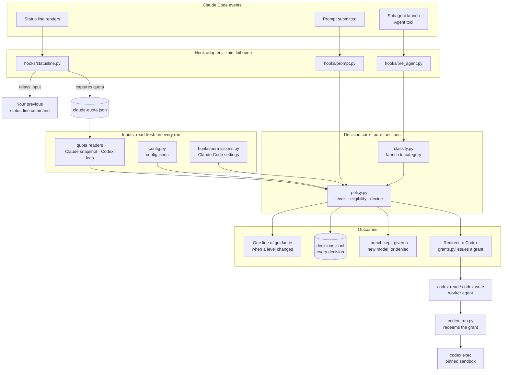
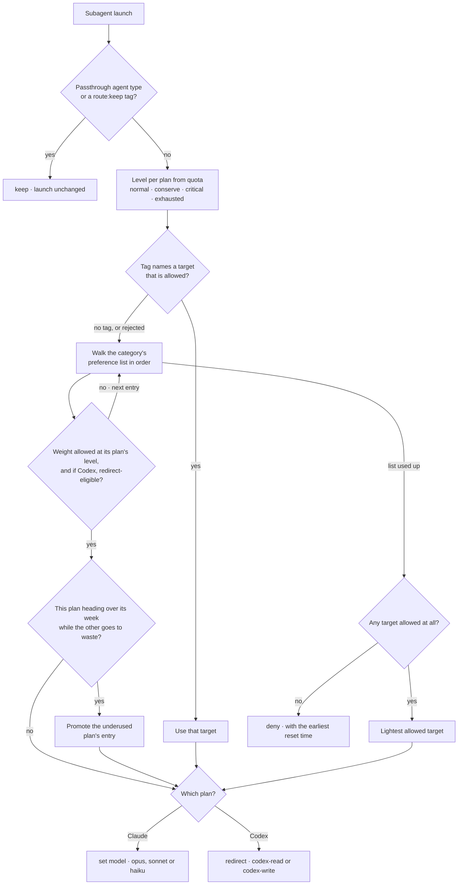
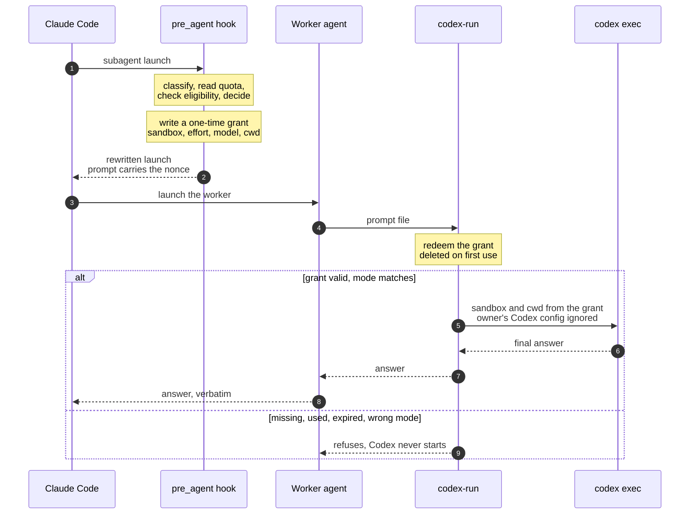

# Model Router

A Claude Code plugin that decides, for each subagent launch, which model
should do the work: a Claude model on your Claude plan, or Codex on your
ChatGPT plan. It decides from your preference list and how much of each
plan's allowance is left.

Design: `docs/superpowers/specs/2026-10-09-model-router-design.md`

## Commands

    bin/router status               quota, level per plan, config state
    bin/router explain "<task>"     dry-run a decision
    bin/router log -n 20            recent decisions and why

## Configuration

Copy `config.example.jsonc` to `~/.config/model-router/config.jsonc`.

The router changes launches only when that file exists, is valid, and sets
`"mode": "enforce"`. With no file it runs in shadow mode: it logs what it
would do and changes nothing. With an invalid file it does nothing at all;
`bin/router status` lists the errors.

## Overrides

- `[route:opus]`, `[route:codex]`, or any target name, in a task prompt:
  use that target. Beats conserve and critical, not exhausted.
- `[route:keep]` in a task prompt: leave this launch alone.
- `MODEL_ROUTER=off` in the environment: off for that session.
- `"mode": "shadow"` or `"off"` in the config: off everywhere.

## Architecture

The router is three thin hook adapters around a decision core of pure
functions. The adapters do the reading and writing; the core takes plain
values and returns a decision, so it can be tested without Claude Code.

Read it top to bottom. Each Claude Code event reaches one adapter. The two
hooks hand the launch and the current inputs to the core, and the core's
answer becomes one of the outcomes at the bottom. The status line takes no
decisions: it only saves the quota reading that the next decision will use.

| Part | Files | Job |
|---|---|---|
| Entry | `bin/router`, `entry.py` | Sends hooks and the status line straight to their handlers, loading as little as possible. Everything else goes to `cli.py`. |
| Hook adapters | `hooks/pre_agent.py`, `hooks/prompt.py`, `hooks/statusline.py` | Read the hook input, call the core, print the hook response. Any failure prints nothing, so the launch proceeds untouched. |
| Inputs | `config.py`, `quota/`, `hooks/permissions.py` | The config (valid, absent, or invalid), both plans' usage windows, and whether file-scoped deny or ask rules exist. |
| Decision core | `classify.py`, `policy.py` | Name the task's category, set each plan's level, check redirect eligibility, and pick a target. No I/O. |
| Codex path | `grants.py`, `codex_run.py`, `agents/` | Carry a redirected task to Codex inside a sandbox the hook fixed. |
| Records | `decision_log.py`, `state.py` | One log line per decision, and what each session has already been told. |

### How one launch is routed

`policy.decide()` applies these steps in order. A Codex target that is not
eligible is skipped, never downgraded to a weaker sandbox.

A plan's level is the worst of its 5-hour and weekly windows. Heavy targets
stop at conserve, medium at critical, and light at exhausted. In shadow mode
the decision is logged and nothing is changed.

### How a Codex redirect stays inside its sandbox

Eligibility is checked once, in the hook. A one-time grant carries that
approval to the point where Codex starts, so neither the prompt text nor the
worker can ask for a wider sandbox, and a worker launched directly has
nothing to run with.

A launch is eligible for redirect only when its agent type is on the
redirectable list, it was not launched from inside another subagent, the
session's permission mode allows that sandbox, and no file-scoped deny or ask
rules exist. Anything unknown blocks the redirect; the task then stays on
Claude and only its model can change.

## Limits

- It routes subagent launches. It cannot change the main conversation's
  model; it suggests a `/model` switch when a plan's level changes.
- A task goes to Codex only when your session's permission mode allows it
  and no file-scoped deny rules exist. See `read_redirect_modes` and
  `write_redirect_modes`.
- Inside a Codex run, Claude Code's Bash rules do not apply to the commands
  Codex runs. The Codex sandbox is the boundary.
- That sandbox does not protect the paths Claude Code guards in every mode,
  such as `.claude/` and `.mcp.json`. A write redirect could edit them where
  Claude Code would have asked first. Be deliberate about which modes you
  list in `write_redirect_modes`.
- Routed Codex runs ignore `~/.codex/config.toml`, so its plugins and
  settings do not apply to them. To choose the Codex model, add `"model"` to
  a Codex target; otherwise Codex uses its built-in default.
- `router codex-run` is internal. It starts Codex only for a launch the hook
  redirected, once, within 30 minutes; run by hand it refuses.
- Codex's quota on disk updates only when Codex runs.

## Development

    /usr/bin/python3 -m venv .venv && .venv/bin/pip install -r requirements-dev.txt
    .venv/bin/python -m pytest

Runtime code uses the Python 3.9 standard library only.
